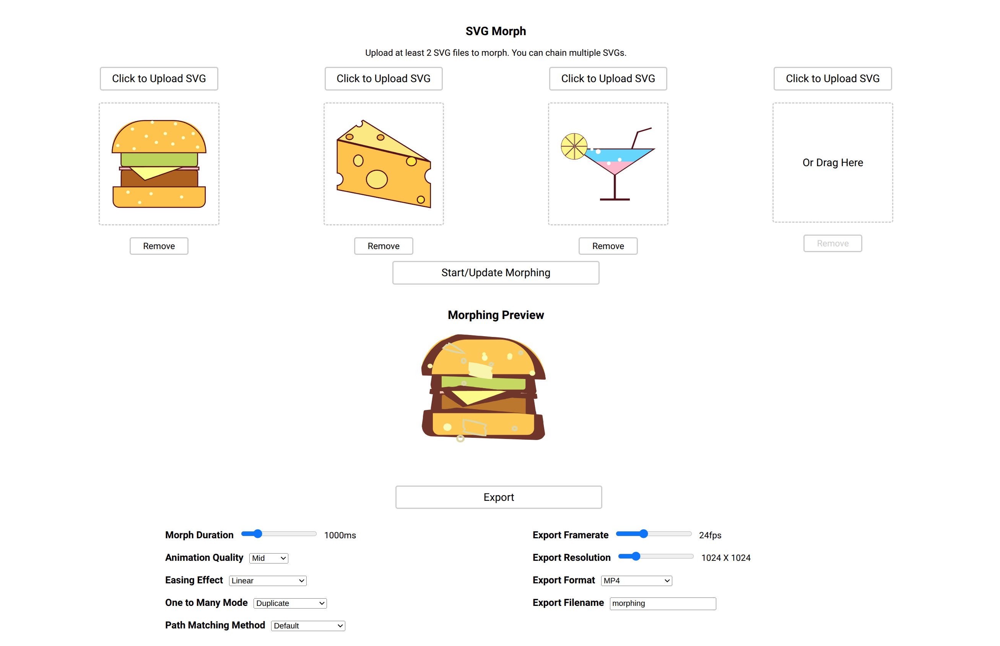

# A Simple SVG Morphing Tool

Able to morph the path shape, color, and stroke lines of uploaded SVGs.  

  

Features:  

- Supports any number of SVG images  
- Transition both shape and color  
- Handling holes in SVG images  
- Exports to MP4 in up to 4K resolution  
- Custom animation easing effects  

## Building

```
npm install
npm run build
```

## Running

```
npm install
npm start
```

## Tools

JavaScript, D3, Flubber, FFmpeg  

## Credits

Demo SVGs from: <https://www.svgrepo.com/>

## User Interface



## Demo  

Complex Shapes with Holes + Multiple SVG Chaining:  

